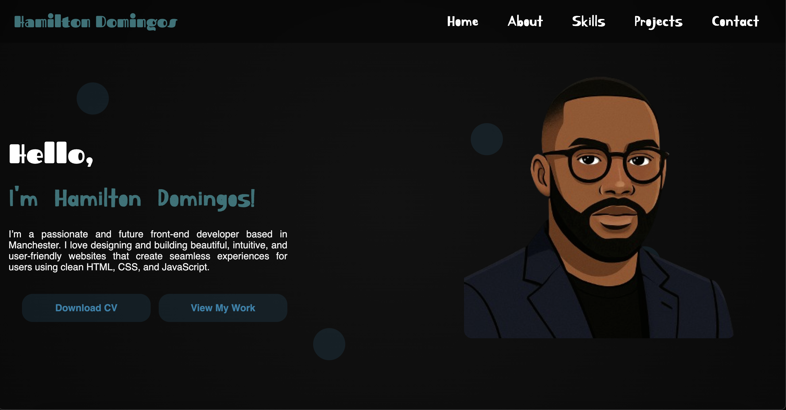

# Overview
Welcome to **Hamilton Domingos’s Portfolio**! A sleek and responsive personal website built with HTML and CSS—designed to highlight my front-end skills, creativity, and projects in a clean, modern style.

The website can be accessed here: [My Live Portfolio]®

# Features
- **Responsive navigation bar**  

  A neat collapsible menu featuring clever icons that toggle between open/close states via Font Awesome.

- **Hero section with personal branding**

  Friendly greeting, my name highlighted, a short personal summary, and calls-to-action to download my CV or view my projects.

- **Floating shapes accent effect**  

  A decorative touch with animated shapes drifting in the background for a dynamic look.

# Tech Used
- **HTML5** – Semantic structure for accessibility and clarity  
- **CSS3** – Styles, responsive design, and visual effects  
- **Google Fonts** – Custom fonts: *Fascinate*, *Fredericka the Great*, *Kirang Haerang*, *Ribeye Marrow*, *Rye*  
- **Responsive best practices** – Includes viewport meta config for mobile adaptability
- **VSCode** – used as the primary tool for writing and editing code.
- **Git** – used for version control of the website.
- **GitHub** – used to host the website’s code.

# Testing
To verify correct functionality, responsiveness, and visual appearance:

1. **Website was opened in different browsers** (Chrome and Firefox) to check compatibility.  

- **Chrome**
 
 
 
 

- **Firefox**
 
 

2. **The website’s responsiveness was also verified using the Chrome extension - Responsive Viewer**
 

3. **The HTML code has been validated and passed the W3C HTML standards check**

4. **The CSS code has been validated and passed the W3C CSS standards check**

5. **Lighthouse**
- The site has been assessed using Lighthouse across key areas—Performance, Accessibility, Best Practices, and SEO.

# Contact
I’m happy to receive any suggestions or feedback. If you have questions or comments about my projects, feel free to get in touch.

**Email**: hamilton.fernandosh@gmail.com

**GitHub Repository**: https://github.com/Hamilton2025/Portfolio.git
